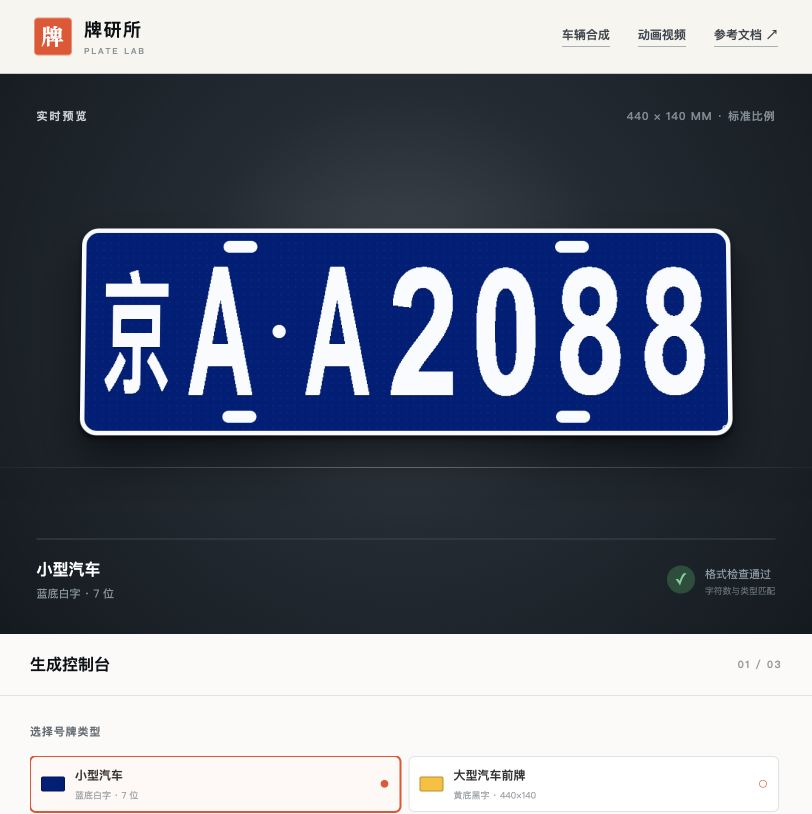

# 牌研所｜中国机动车号牌生成器

一个基于公开号牌规则制作的中国机动车号牌样式生成工具，支持随机生成、指定号码、实时预览和高清 PNG 导出。

> 本项目仅用于设计、开发测试和数据集制作，请勿用于伪造号牌或其他违法用途。

## 效果预览



## 功能

- 支持普通蓝牌、大型汽车前/后黄牌和新能源号牌
- 支持教练车、挂车及港澳入出境车辆号牌
- 支持拖拉机、厂（场）内、港口和民航场内车辆号牌
- 支持普通临牌、试验车临牌、特型车临牌和临时入境号牌
- 自动排除普通序号中容易混淆的 `I`、`O`
- 可指定省份、城市代码和号码段
- 模拟反光膜、压印边框、双色分区等视觉效果
- 按 440×140、480×140、440×220 和 220×140 mm 等真实外廓比例预览
- 支持导出约 300 DPI 的高清 PNG
- 支持上传车辆正面图片，使用 LPD-YuNet 自动识别原车牌四角、尺寸和倾斜透视
- 模型未找到车牌或加载失败时自动回退到本地颜色与纹理扫描
- 识别后仍可拖动、缩放、调整高度和旋转当前车牌
- 可将车辆合成图制作成上、下、左、右四种方向的平移动画
- 可选择 480p、720p、1080p 或自定义视频宽高（最高 3840×2160）
- 可调整移动速度，实时预览并导出 30 FPS 的 MP4 或 WebM 视频
- 车辆图片仅在本机浏览器处理，不会上传或保存到服务器
- 适配桌面端和移动端

## 环境要求

- Node.js `>= 22.13.0`
- npm `>= 10`，或 pnpm `>= 10`

检查当前环境：

```bash
node -v
npm -v
```

如果 Node.js 版本过低，推荐使用 [nvm](https://github.com/nvm-sh/nvm) 安装 Node.js 22：

```bash
nvm install 22
nvm use 22
```

## 启动项目

克隆仓库：

```bash
git clone https://github.com/tdot1415926-svg/china-license-plate-generator.git
cd china-license-plate-generator
```

安装依赖：

```bash
npm install
```

启动开发服务器：

```bash
npm run dev
```

终端出现本地地址后，在浏览器访问：

```text
http://localhost:3000
```

停止服务时，在运行开发服务器的终端按 `Ctrl + C`。

### 使用 pnpm

项目同时包含 pnpm 锁文件，也可以使用：

```bash
pnpm install
pnpm dev
```

请勿在同一次安装中混用 npm 和 pnpm。

## 构建生产版本

```bash
npm run build
npm run start
```

## Docker 部署

从 GitHub Container Registry 拉取公共镜像：

```bash
docker pull ghcr.io/tdot1415926-svg/china-license-plate-generator:latest
```

启动容器：

```bash
docker run --detach \
  --name china-license-plate-generator \
  --publish 3000:3000 \
  ghcr.io/tdot1415926-svg/china-license-plate-generator:latest
```

浏览器访问 `http://localhost:3000`。镜像同时支持 `linux/amd64` 和 `linux/arm64`。

也可以在项目根目录自行构建：

```bash
docker build --tag china-license-plate-generator:local .
docker run --rm --publish 3000:3000 china-license-plate-generator:local
```

## 常用命令

| 命令 | 说明 |
| --- | --- |
| `npm run dev` | 启动本地开发服务器 |
| `npm run build` | 构建生产版本 |
| `npm run start` | 启动生产服务器 |
| `npm run lint` | 执行代码检查 |
| `npm test` | 执行项目测试 |

## 项目结构

```text
app/
├── page.tsx       # 号牌规则、生成逻辑、透视合成和页面交互
├── plate-detector.ts # LPD-YuNet 浏览器推理与四角解码
├── globals.css    # 号牌材质与页面样式
└── layout.tsx     # 页面元数据
public/
├── models/        # 中国车牌定位模型及其许可证
└── og.png         # 项目分享封面
docs/
└── screenshots/   # README 项目效果截图
worker/
└── index.ts       # Cloudflare Worker 入口
```

## 规则参考

号牌类型和基础样式参考：

- [中华人民共和国机动车号牌](https://zh.wikipedia.org/wiki/中华人民共和国机动车号牌)
- [中华人民共和国机动车号牌（百度百科）](https://baike.baidu.com/item/中华人民共和国机动车号牌/65692407)
- 公共安全行业标准《中华人民共和国机动车号牌》GA 36—2018

字符坐标与单双层合成思路参考 MIT 许可项目
[Pengfei8324/chinese_license_plate_generator](https://github.com/Pengfei8324/chinese_license_plate_generator)，
当前项目使用网页原生绘制重新实现，没有复制其底板或防伪素材。

单层号牌的 440×140 mm 底板、45×90 mm 字符单元、12 mm 字距、10 mm
间隔点及长圆安装标记布局参考
[longwosion/carplate](https://github.com/longwosion/carplate) 的公开实现逻辑；由于该仓库未声明素材许可，
本项目没有复制其中的字符精灵图片，使用自有 CSS 与 Canvas 绘制重新实现。

导出时会把自有字体逐字栅格化为独立的二值字符缓存，再按字符框贴到底板上，获得与精灵图方案相同的固定字宽和硬边缘效果。
页面预览和 PNG 导出共用同一个 Canvas 渲染器，预览是导出图的等比例缩小版本。

车辆图片定位使用 OpenCV Zoo 的
[LPD-YuNet 中国车牌检测模型](https://github.com/opencv/opencv_zoo/tree/main/models/license_plate_detection_yunet)。
项目内置约 4 MB 的 FP32 模型，通过 ONNX Runtime Web 在浏览器本地推理；模型输出的四个角点用于透视贴图，
而不是只将新号牌放进水平矩形框。模型按 Apache License 2.0 发布，许可证副本位于 `public/models/LICENSE-LPD-YuNet.txt`。
ONNX Runtime Web 的执行文件从固定版本 CDN 加载，车辆原图和合成结果不会上传。首次加载超时会立即回退到本地扫描，
运行库缓存完成后可点击“重新识别”使用 AI 四角定位。

车辆动画使用浏览器原生 Canvas 与 MediaRecorder 生成。视频预览和导出共用同一个逐帧渲染函数，
速度以输出画布中的像素/秒计算；浏览器支持 H.264 时导出 MP4，否则导出 WebM。

公开资料可能存在更新或地区差异，本项目不属于官方号牌核验服务。

## 技术栈

- React 19
- TypeScript
- Vite / vinext
- Cloudflare Workers

## License

仅供学习、设计和测试使用。
